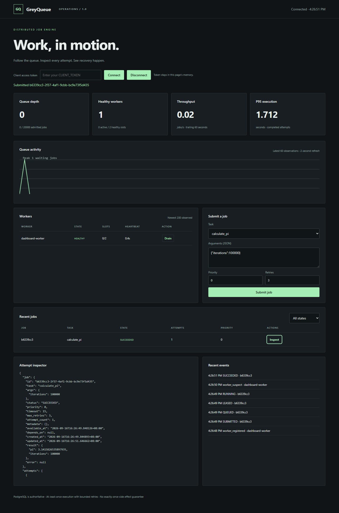

# GreyQueue

**Fault-tolerant distributed job engine · v1.0**

A portfolio implementation of a durable queue, scheduler, worker runtime and recovery engine. PostgreSQL owns state; FastAPI serves the control plane; independent workers execute registered tasks. No Celery, broker or managed job framework hides the queue mechanism.



## Implemented releases

| Release | Delivered |
| --- | --- |
| v0.1 | Durable submit → claim → execute → persist → retrieve |
| v0.2 | FIFO/priority/capability-aware scheduling, capacity slots, four execution strategies |
| v0.3 | Heartbeats, suspect/dead detection, renewable leases, fencing and crash recovery |
| v0.4 | Backoff/jitter, permanent vs retryable failures, attempt history, dead letters, submission idempotency |
| v0.5 | Request/worker logs, durable events, Prometheus metrics, interactive dashboard |
| v0.6 | Reproducible CPU/I/O/mixed benchmarks, resource measurements, charts, batched result reads |
| v1.0 | Worker session isolation, bounded admission, container restrictions, scheduled jobs, dependencies, multiple coordinators |

See [validation](docs/validation.md), [architecture](docs/architecture.md), [failure model](docs/failure-model.md) and [benchmarks](docs/benchmarks.md). This is a tested engineering portfolio release; operating an internet-facing or highly available production service also requires environment-specific TLS, database backups/replication and monitoring.

## Docker quick start

Requires Docker Compose. Initialize independent random development credentials, then start PostgreSQL, the migration, one coordinator and three workers:

```sh
python scripts/configure.py
docker compose up --build --scale worker=3
```

Open **http://127.0.0.1:8810/dashboard** and enter CLIENT_TOKEN from your ignored `.env`. The token stays in page memory. The dashboard submits jobs, shows live workers/queue metrics, inspects attempts/results, cancels waiting jobs and drains workers.

OpenAPI: `/openapi.json`; interactive API reference: `/docs`. All job/operations endpoints require `Authorization: Bearer <CLIENT_TOKEN>`. Worker endpoints require the separate bootstrap credential and a worker-specific session. The PostgreSQL port is not published. `docker compose down` preserves the database volume. `--scale worker=5` adds capacity.

## Native Windows development

Requires Python 3.12+, uv, and PostgreSQL 18 binaries. Start in this repository:

```powershell
uv sync --frozen
uv run python scripts/local_db.py start
uv run alembic upgrade head
uv run uvicorn greyqueue.api:create_app --factory --host 127.0.0.1 --port 8810
```

Run `uv run greyqueue-worker` in three additional terminals. Each process generates its own worker ID and has two slots by default. Configure `CAPACITY`, `EXECUTOR` and other settings in `.env` (see [.env.example](.env.example)). The local database helper creates only `.runtime/postgres` on port 55441 and generates credentials on first use; **do not run configure.py before initializing this native cluster**. It refuses to overwrite an existing `.env`. Set POSTGRES_BIN if binaries are elsewhere.

```powershell
uv run greyqueue submit calculate_pi --args '{"iterations":100000}' --priority 5 --idempotency-key research-001
uv run greyqueue submit flaky --args '{"failures":2}' --max-retries 3
uv run greyqueue get <job-id>
uv run greyqueue attempts <job-id>
uv run greyqueue jobs --state DEAD_LETTER
uv run greyqueue drain <worker-id>
```

Use `--scheduled-at` with a timezone-aware ISO timestamp, or `--depends-on <job-id>`. Dependencies reference existing jobs and are immutable; children wait for success and cancel if a parent fails. Running cancellation is deliberately unsupported; drain finishes active work and stops new claims.

## Reproduce the evidence

```powershell
$env:TEST_DATABASE_URL = uv run python -c "from greyqueue.config import settings; print(settings().database_url)"
uv run pytest -q
uv run ruff check .
uv run ruff format --check .
uv run alembic check
uv run python -m scripts.experiments
uv run python -m scripts.side_effects
uv run python -m scripts.profile_reads
uv run playwright install chromium
uv run python -m scripts.check_dashboard
uv run python -m benchmarks.run --jobs 100 --matrix
uv run python -m benchmarks.run --jobs 1000 --strategy hybrid --workload mixed
uv run python -m benchmarks.run --jobs 10000 --strategy hybrid --workload light
```

Experiments/benchmarks create and drop uniquely named schemas, own their child processes, and save measured evidence in `docs/results`. Use the project development database, never production. `scripts.experiments --database-outage` additionally stops and restarts only the verified helper-owned database on port 55441. Without TEST_DATABASE_URL, database tests skip explicitly. Linux CI repeats PostgreSQL tests and process/browser demonstrations.

Stop the isolated native database with `uv run python scripts/local_db.py stop` after closing applications using it.

## Guarantees and limits

- PostgreSQL transactions enforce exclusive active claims and per-worker slots. A renewed or reassigned attempt fences stale database updates.
- Execution is at-least-once with bounded retries while storage/coordinators/workers recover; it is not a promise that every accepted task eventually succeeds. Exhaustion is visible in DEAD_LETTER.
- External side effects may repeat. Submission deduplication and sink-side idempotency solve different problems; see the [crash-before-ack demo](docs/idempotency.md).
- `subprocess` is the default for killable task timeouts. Threads/process pools cannot forcibly stop one Python 3.12 callable; they retain its slot until it drains and discard late output. Tasks remain allowlisted and bounded.
- Multiple coordinators can share PostgreSQL; a load balancer or client routing is still required for endpoint failover. PostgreSQL is the single authority and availability dependency.
- Metrics summarize persistent history; the dashboard shows bounded recent rows. Benchmarks are local measurements, not production capacity claims.
