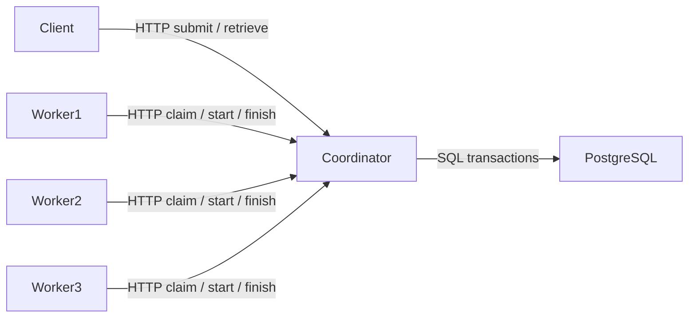

# GreyQueue v0.1 architecture

## Scope and components
Milestone 0 and the first vertical slice: submit → queue → claim → execute → persist → retrieve. One FastAPI coordinator handles requests; PostgreSQL is authoritative; three independent asyncio worker processes poll HTTP. Workers execute only validated registered tasks. No broker or task framework implements the queue.

## State machines
Jobs: SUBMITTED → QUEUED in one submission transaction; QUEUED → LEASED → RUNNING → SUCCEEDED or FAILED. QUEUED → CANCELLED. LEASED means a nonexpiring assignment in this release; there is no lease deadline or recovery claim. RETRY_WAIT and DEAD_LETTER are future states, not implemented promises.
Workers: registration → HEALTHY. Heartbeats update last_seen; this is an observation, not proof of liveness. Future HEALTHY → SUSPECT → DEAD and HEALTHY → DRAINING require failure detection and drain protocols.

## Schema and transactions
UUID jobs hold task name, validated JSON arguments, status and timestamps. Workers hold ID and observed heartbeat. Attempts hold assignment token, job/worker IDs and start/finish timestamps. Results hold JSON output or bounded error text, one per job. Append-only job events record transitions.
Submission inserts the job and SUBMITTED/QUEUED events atomically. Claim locks the worker row (one active assignment per worker), selects the oldest QUEUED job with FOR UPDATE SKIP LOCKED, inserts an attempt and transitions to LEASED in one transaction. A unique partial index enforces at most one active attempt per worker. Start, completion and cancellation lock the job row and validate state. Completion verifies worker ID plus attempt token and atomically commits terminal state, result and event. Duplicate identical completion is acknowledged; conflicting completion is rejected. This is protocol acknowledgement handling, not submission deduplication or exactly-once execution.

## Concurrency and failure boundaries
Each HTTP request owns its SQLAlchemy session and transaction. Synchronous FastAPI routes run in the thread pool; workers use asyncio for polling and heartbeats, with one isolated subprocess per task. A subprocess timeout bounds task execution. No task may access arbitrary files, URLs or executable code. Claim versus cancellation serializes on the job lock. Competing claims skip locked jobs; FIFO is approximate under concurrency. Database commit before HTTP reply can leave an unknown claim outcome; polling again returns the existing assignment. Completion retries send the same result without executing again. Worker process loss leaves its assignment stuck; coordinator restart retains database state. There is no at-least-once recovery guarantee yet. No exactly-once side-effect guarantee is planned.

## Package and configuration
`greyqueue/api.py`: HTTP boundary; `service.py`: transactional state changes; `models.py`: persistence; `tasks.py`: allowlisted validated functions; `worker.py`: HTTP polling/execution; `cli.py`: user commands. Alembic owns schema changes. DATABASE_URL, CLIENT_TOKEN, WORKER_TOKEN, COORDINATOR_URL, WORKER_ID and POLL_INTERVAL configure processes. Secrets belong in ignored .env files. Local HTTP bearer tokens are a development boundary; shared worker credentials do not isolate mutually untrusted workers. Remote exposure requires TLS and stronger identities.

## Deployment and tests
Compose runs PostgreSQL, one migration container, coordinator and worker replicas (`--scale worker=3`). Database is private to the Compose network, API port binds loopback. Native Windows demo uses an isolated local PostgreSQL cluster and one coordinator plus three subprocess workers. Unit tests validate registered inputs. PostgreSQL integration tests exercise conflicting claims, wrong ownership, transitions, completion replay and cancellation. The network demo records actual worker distribution and elapsed time; it is a smoke measurement, not a benchmark.

## Roadmap
- v0.1: this durable vertical slice and architecture.
- v0.2: scheduling policies, priorities and bounded concurrent execution.
- v0.3: heartbeats, expiring leases, fencing and crash recovery.
- v0.4: retries, backoff, dead letters and submission idempotency.
- v0.5: metrics, structured tracing and operational dashboard.
- v0.6: reproducible throughput/latency/failure benchmarks and optimization.
- v1.0: hardening, security and advanced distributed functionality after measured validation.

## Decisions and alternatives
HTTP polling keeps control flow observable and needs no broker; it trades latency and request traffic for simplicity. PostgreSQL transactions keep queue and results consistent; an external broker would introduce dual-write coordination and hide the learning objective. Separate task subprocesses bound failures and timeouts but cost startup overhead; thread/process pool comparisons belong to the concurrency stage. SQLAlchemy sessions are per request, never shared across concurrent work. We defer async database sessions because short synchronous transactions simplify the initial implementation.

References: [PostgreSQL SELECT locking](https://www.postgresql.org/docs/18/sql-select.html), [SQLAlchemy session concurrency](https://docs.sqlalchemy.org/en/20/orm/session_basics.html), [FastAPI lifespan](https://fastapi.tiangolo.com/advanced/events/).
