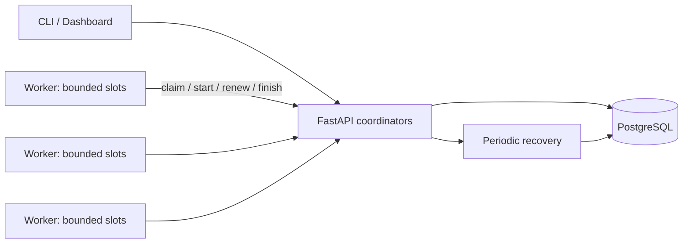

# GreyQueue v1.0 architecture

## Responsibilities
The API authenticates, bounds and validates inputs. `service.py` owns transactional state changes. `scheduler.py` selects eligible work. Workers poll asynchronously and execute through `executors.py`. `recovery.py` derives expired attempts and worker health from durable timestamps. `observability.py` aggregates SQL state; the dashboard is a same-origin client.

PostgreSQL stores jobs, results, attempts/leases, workers, job events and system events. No important ownership state is held only in memory. Each HTTP request has its own SQLAlchemy session, with commit before a success response. Worker session credentials live in process memory; their hashes and worker identities persist. A restarted worker generates a new identity.

## Advanced scope
Scheduled eligibility timestamps, immutable single-parent dependencies (a forest of DAGs), and multiple active coordinators are implemented. Shared transaction locks make admission and claims consistent across coordinators. Recovery uses a transaction-scoped advisory mutex, not a permanent leader. There is no custom consensus algorithm, database replication implementation, arbitrary DAG fan-in or queue partitioning.

## Release map
The original 14 engineering stages are grouped into v0.1, v0.2, v0.3, v0.4, v0.5, v0.6 and v1.0. The initial vertical slice remains in commit df80a55. Later release concepts and reproducible demonstrations are indexed in [validation](validation.md).

Read [transactions](transactions.md), [scheduler](scheduler.md), [delivery semantics](delivery-semantics.md), [security](security.md), and [design decisions](design-decisions.md).
