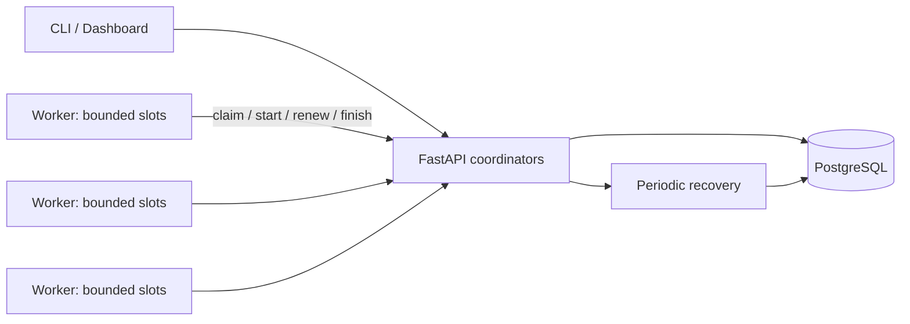

# GreyQueue v1.0 architecture

```mermaid
flowchart LR
 Client[CLI / Dashboard] --> API[FastAPI coordinators]
 API --> DB[(PostgreSQL)]
 Worker1[Worker: bounded slots] -->|claim / start / renew / finish| API
 Worker2[Worker: bounded slots] --> API
 Worker3[Worker: bounded slots] --> API
 API --> Recovery[Periodic recovery]
 Recovery --> DB
```

## Responsibilities
The API authenticates, bounds and validates inputs. `service.py` owns transactional state changes. `scheduler.py` selects eligible work. Workers poll asynchronously and execute through `executors.py`. `recovery.py` derives expired attempts and worker health from durable timestamps, and cancels waiting children of failed, dead-lettered or cancelled parents. `observability.py` aggregates SQL state; the dashboard is a same-origin client.

PostgreSQL stores jobs, results, attempts/leases, workers, job events and system events. No important ownership state is held only in memory. Each HTTP request has its own SQLAlchemy session, with commit before a success response. Worker session credentials live in process memory; their hashes and worker identities persist. A restarted worker generates a new identity unless WORKER_ID is fixed; a fixed ID can re-register with a new session credential only after its previous holder is DEAD (ADR 007).

Job states change only through `service.transition`. Worker states (HEALTHY, SUSPECT, DEAD, DRAINING) are set directly by registration (a takeover of a DEAD ID, or a replay that revives one), heartbeat, drain and recovery, and are bounded by a CHECK constraint. Drain intent is stored separately so it survives SUSPECT/DEAD (ADR 009). In Compose the coordinator connects as a least-privilege role that cannot delete rows or change the schema (ADR 008). Registration, heartbeat and drain are the routes that mutate worker rows themselves; job routes delegate to `service.py`.

## Advanced scope
Scheduled eligibility timestamps, immutable single-parent dependencies (a forest of DAGs), and multiple active coordinators are implemented. Shared transaction locks make admission and claims consistent across coordinators. Job recovery uses a transaction-scoped advisory mutex, not a permanent leader; worker-health detection runs on every coordinator under SKIP LOCKED. There is no custom consensus algorithm, database replication implementation, arbitrary DAG fan-in or queue partitioning, nor cancellation of running jobs, exactly-once effects or fairness guarantees.

## Release map
The original 14 engineering stages are grouped into v0.1, v0.2, v0.3, v0.4, v0.5, v0.6 and v1.0. The initial vertical slice remains in commit df80a55. Later release concepts and reproducible demonstrations are indexed in [validation](validation.md).

Read [transactions](transactions.md), [scheduler](scheduler.md), [concurrency model](concurrency-model.md), [job lifecycle](job-lifecycle.md), [worker lifecycle](worker-lifecycle.md), [delivery semantics](delivery-semantics.md), [failure model](failure-model.md), [idempotency](idempotency.md), [persistence](persistence.md), [security](security.md), and [design decisions](design-decisions.md).
