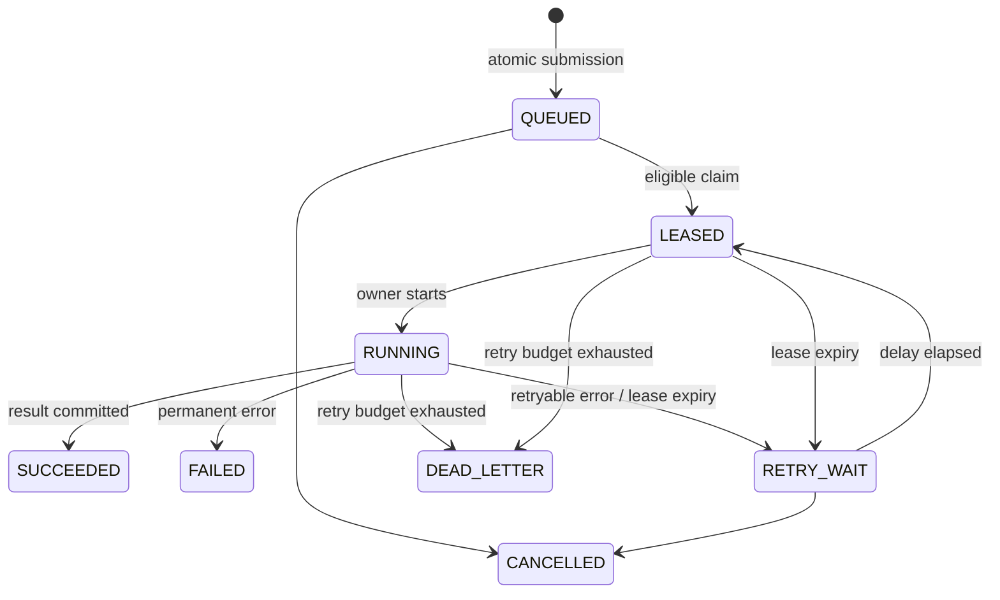

# Job lifecycle

SUBMITTED is a durable event in the same transaction as QUEUED; clients cannot observe a half-submitted job. `service.TRANSITIONS` rejects illegal domain transitions. Each attempt owns a UUID token, increasing per-job fence, worker/slot, expiry, timestamps, outcome, output and error. Results represent terminal output. An identical finish replay acknowledges the recorded attempt without changing a later attempt's state.

The API defaults to three retries (up to four attempts), a 15-second task timeout and one-second base delay with jitter. Retry delay is exponential, with a 3600-second base cap before optional 0.5–1.5 jitter. Max retries is capped at ten. Permanent failures do not retry. Failed dependencies cancel waiting children. DEAD_LETTER is inspectable through job filters and attempt history; resubmitting is an explicit new job with a new idempotency key.
